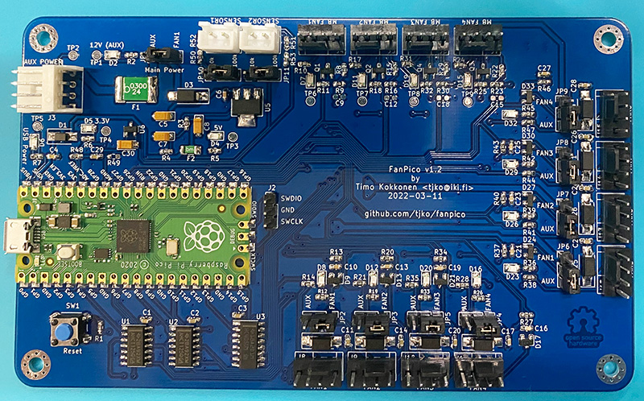
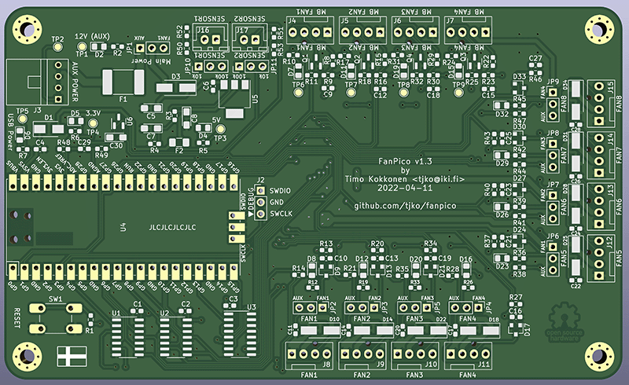
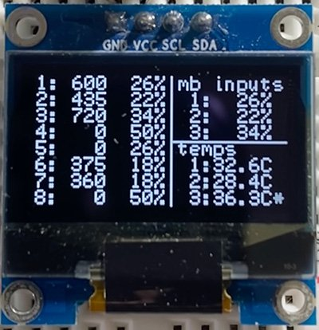

# Fanpico: Smart PWM (PC) Fan Controller

Fanpico is a smart PWM (PC) fan controller based around Raspberry Pi Pico (RP2040 MCU). Fanpico operates as standalone controller that can be configured and left running. It does not require any drivers and doesn't care what OS is being used.

## What is it for?
* Fanpico is for customizing fan "curves" to fine tune how your motherboard controlled fans run.
* Monitoring fan speeds and behaviour as well as monitoring what exactly motherboard is doing.
* Customizing fan behaviour based on (motherboard) inputs and/or temperature from temperature sensors.

## Features
* Controls up to 8 fans. 
* Connect up to 4 motherboard fan outputs.
* Connect up to 2 remote temperature probes (plus onboard "ambient" temperature sensor).
* Attached or remove (OLED) display support (boards where model name ends with "D").
* Can be powered from motherboard fan outputs or using (AUX) 4-pin floppy connector.
* Ability to define custom fan "curves" for each fan.
* Ability to provide custom tachometer (fan RPM) output singal back to motherboard.
* Control fans from any motherboard PWM signal or from temperature sensors.
* OS Independent, no drivers or software needed.
* Configuration stored on the device itself (in the flash memory).
* SCPI "like" programming interface (see [Command Reference](commands.md))
* Monitor each fan and motherboard output signals as well as temperatures.

## Hardware
Fanpico is Open Source Hardware, reference design is provided for the "0804" model (8 fan outpus and 4 motherboard fan inputs). 
Initially Fanpico will be only a DIY project, but if there is succifient interested then DIY kits may be made available. Since this is Open Hardware, we hope that there will be sellers that eventually offer pre-built units as well as kits....

Additional models with different combinations of fan inputs/outputs could be easily designed (takining into account limitations of Raspberry Pi Pico I/O limits). New and improved PCB models/designs are most welcome.



### Hardware Design
Fanpico (reference design) utilizes all available I/O pins on a Raspberry Pi Pico.
* Fan PWM outputs are driven by the Pico's PWM hardware.
* Motherboard Fan PWM inputs are read using Pico's PWM hardware.
* Tacho signal output (for motherboard connectors) is generated using Pico's PIO hardware, providing extremely stable tachometer signal.
* Tacho signal inputs (from fans) is read using GPIO interrupts (counting number of pulses received over a period of time)
* Temperature readings are done using ADC, with help of a accurrate 3V voltage reference (LM4040). Any NTC (10k or 100k) thermistors can be used as themperature sensors.
* Each FAN output has jumper to select whether fan gets its power from associated MBFAN connector or from the AUX connector
* There is a jumper to select wheter power the Fanpico itself from MBFAN1 or AUX connector.

To help design and test Fanpico couple other projects were born:
* [Tiny PicoProbe](https://github.com/tjko/tiny-picoprobe/) - tiny PicoProbe implementation.
* [Fan Test Adapter](https://github.com/tjko/fan-test-adapter/) - adapter to help simulate motherboard fan outputs.

### Models (PCB designs)
Currently following models are available:

|Model|Fans (Outputs)|MB Fan (Inputs)|External Temperature Sensors|Display|Notes|
|-----|--------------|---------------|-------------------|--------|-----|
|[FANPICO-0804](boards/fanpico-0804/)|8|4|2|N|First publicly available board (reference design).|
|FANPICO-0804D|8|4|2|Y|Support for OLED (128x64) displays. PCB Under development.|

(all boards have one additional 'on-board' temperature sensor on the RP2040 MCU itself)

Reference PCB (FANPICO-0804 was designed with KiCad.


Models ending with "D" support a display to see 'real-time' status of fans and temperatures.


## Firmware
Firmware is developed in C using the Pico SDK. Pre-compiled firmware is released when there is new major features or bug fixes.

Latest pre-compiled firmware image can be found here: [Releases](https://github.com/tjko/fanpico/releases)

To get latest firmware with latest updates/fixes you must compile the firmware from the sources.


### Installing firmware image
Firmware can be installed via the built-in UF2 bootloader on the Raspberry Pi Pico or using the debug header with Picoprobe, etc...

Firmware upgrade steps:
* Boot Pico into UF2 bootloader. This can be done in two ways:
  1)  Press and hold "bootsel" button and then press and release "reset" button.
  2)  Issue command: SYS:UPGRADE
* Copy firmware file (fanpico.uf2) to the USB mass storage device that appears.
* As soon as firmware copy is complete, Pico will reboot and run the fanpico firmware.

### Building Firmware Images

Raspberry Pi Pico C/C++ SDK is required for compiling the firmware: 

#### Requirements / Dependencies
* [Raspberry Pi Pico C/C++ SDK](https://www.raspberrypi.com/documentation/microcontrollers/c_sdk.html)
* [cJSON](https://github.com/DaveGamble/cJSON)
* [littlefs-lib](https://github.com/lurk101/littlefs-lib)
* [ss_oled-lib](https://github.com/tjko/ss_oled-lib)


##### Install Pico SDK
Pico SDK must be installed working before you can compile fanpico.

Instructions on installing Pico SDK see: [Getting started with Raspberry Pi Pico](https://datasheets.raspberrypi.com/pico/getting-started-with-pico.pdf)

(Make sure PICO_SDK_PATH environment variable is set)

##### Downloading sources

Create some directory for building fanpico ('src' used in this example):
```
$ mkdir src
$ cd src
$ git clone https://github.com/tjko/fanpico.git
$ git submodule update --init --recursive
```

##### Building fanpico firmware

To build fanpico firmware, first create a build directory:
```
$ cd fanpico
$ mkdir build
```

Select which board to build firmware for (default is "0804"):
```
$ cd build
$ cmake -DFANPICO_BOARD=0804 ..
```

Then compile fanpico:
```
$ make
```

After successfull compile you should see firmare binary in the build directory:
subdirectory:

```
$ ls *.uf2
fanpico.uf2
```

If you have picotool installed you can check the firmare image information:
```
$ picotool info -a fanpico.uf2
File fanpico.uf2:

Program Information
 name:          fanpico
 version:       1.1 (Jun 20 2022)
 web site:      https://github.com/tjko/fanpico/
 description:   FanPico - Smart PWM Fan Controller
 features:      USB stdin / stdout
 binary start:  0x10000000
 binary end:    0x10023828

Fixed Pin Information
 0:   Fan8 tacho signal (input)
 1:   Fan7 tacho signal (input)
 2:   Fan1 tacho signal (input)
 3:   Fan2 tacho signal (input)
 4:   Fan1 PWM signal (output)
 5:   Fan2 PWM signal (output)
 6:   Fan3 PWM signal (output)
 7:   Fan4 PWM signal (output)
 8:   Fan5 PWM signal (output)
 9:   Fan6 PWM signal (output)
 10:  Fan7 PWM signal (output)
 11:  Fan8 PWM signal (output)
 12:  MB Fan1 tacho signal (output)
 13:  MB Fan1 PWM signal (input)
 14:  MB Fan2 tacho signal (output)
 15:  MB Fan2 PWM signal (input)
 16:  MB Fan3 tacho signal (output)
 17:  MB Fan3 PWM signal (input)
 18:  MB Fan4 tacho signal (output)
 19:  MB Fan4 PWM signal (input)
 20:  Fan3 tacho signal (input)
 21:  Fan4 tacho signal (input)
 22:  Fan5 tacho signal (input)
 25:  On-board LED
 26:  Fan6 tacho signal (input)
 27:  Temperature Sensor1 (input)
 28:  Temperature Sensor2 (input)

Build Information
 sdk version:       1.3.0
 pico_board:        pico
 build date:        Jun 20 2022
 build attributes:  Release
```


